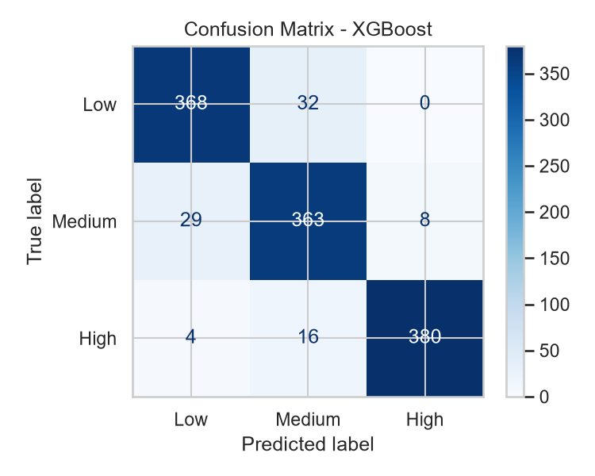
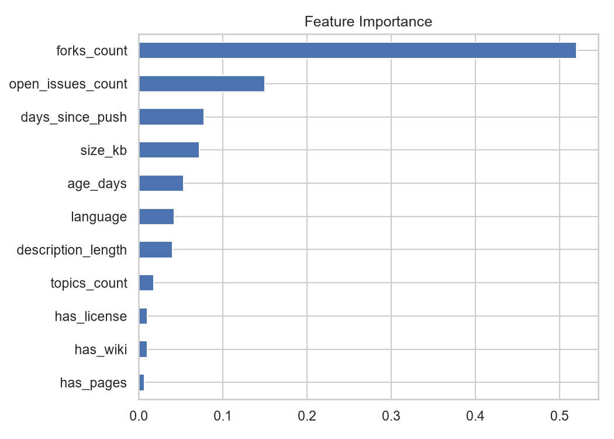

# ⭐ StarGazer AI

**Predict how popular a GitHub repository is, using only its basic metadata.**

StarGazer AI is a supervised machine learning project that classifies a public GitHub repository as **Low**, **Medium**, or **High** popularity from details like language, size, forks, open issues, age, and activity. It covers the full pipeline: data collection from the GitHub API, cleaning and feature engineering, model comparison, and a Streamlit demo app.

---

## Problem Statement

Given basic details of a GitHub repository, predict its popularity class based on star count:

| Class  | Stars      |
|--------|------------|
| Low    | 10 – 99    |
| Medium | 100 – 999  |
| High   | 1000+      |

**ML type:** Supervised learning, multi-class classification.

## Objectives

- Collect a real-world dataset of GitHub repositories using the GitHub Search API
- Compare three ML models: Logistic Regression, Random Forest, and XGBoost
- Evaluate with accuracy, precision, recall, and macro F1
- Deploy the best model in an interactive Streamlit demo

---

## Results

Test-set performance (20% held-out, stratified split):

| Model               | Macro F1   |
|---------------------|------------|
| **XGBoost**         | **0.9262** |
| Random Forest       | 0.9220     |
| Logistic Regression | 0.9216     |

XGBoost was the best model (accuracy 0.9258) and is saved as `models/best_model.joblib` for the demo. Confusion matrix, feature importance, and EDA charts are in [`screenshots/`](screenshots/).

---

## Dataset

- **Source:** GitHub Search API (`requests`), authenticated with a personal access token
- **Coverage:** 10 languages (Python, JavaScript, Java, C++, TypeScript, Go, C#, PHP, Rust, Kotlin) × 3 star ranges (`10..99`, `100..999`, `>=1000`)
- **Raw fields:** `full_name`, `language`, `size`, `forks_count`, `open_issues_count`, `created_at`, `pushed_at`, `topics`, `license`, `description`, `has_wiki`, `has_pages`, `stargazers_count`
- Duplicates removed by `full_name`

### Features

| Feature              | Description                                  |
|----------------------|----------------------------------------------|
| `language`           | Primary language (missing → "Other")         |
| `size_kb`            | Repository size                              |
| `forks_count`        | Number of forks                              |
| `open_issues_count`  | Number of open issues                        |
| `age_days`           | Days since the repo was created              |
| `days_since_push`    | Days since the last push                     |
| `topics_count`       | Number of topics                             |
| `has_license`        | 1 if a license exists, else 0                |
| `description_length` | Characters in the description                |
| `has_wiki`           | 1 or 0                                       |
| `has_pages`          | 1 or 0                                       |

**Target:** `popularity_class` (Low / Medium / High).

> **Avoiding leakage:** `stargazers_count` is used *only* to build the label. It and `watchers_count` (identical to stars on GitHub) are excluded from the features.

---

## Methodology

1. **Data collection** – `src/collect_data.py` runs one query per language and star range, with rate-limit delays and progress saved after every query.
2. **Cleaning and feature engineering** – handle missing values, build the features above, create the label, and save `data/clean_repos.csv`.
3. **EDA** – class distribution, popularity by language, correlation heatmap, and age/forks distributions.
4. **Modeling** – an sklearn `Pipeline` with one-hot encoding for `language`, `log1p` on skewed numeric columns, and `StandardScaler` for Logistic Regression only. Models are compared with 5-fold cross-validation.
5. **Evaluation** – accuracy, precision, recall, and macro F1 on the test set, plus a confusion matrix and feature importance.
6. **Deployment** – `app.py` loads the saved model and serves predictions through Streamlit.

### Models

| Model               | Settings                                                   |
|---------------------|------------------------------------------------------------|
| Logistic Regression | `max_iter=1000` (baseline)                                 |
| Random Forest       | `n_estimators=200`, `random_state=42`                      |
| XGBoost             | `n_estimators=200`, `max_depth=5`, `learning_rate=0.1`     |

Train/test split: 80/20, `stratify=y`, `random_state=42`.

---

## Tech Stack

| Layer           | Tool                          |
|-----------------|-------------------------------|
| Language        | Python 3.10+                  |
| Data collection | `requests` + GitHub Search API |
| Data handling   | `pandas`, `numpy`             |
| Visualization   | `matplotlib`, `seaborn`       |
| Modeling        | `scikit-learn`, `xgboost`     |
| Model saving    | `joblib`                      |
| Demo            | `streamlit`                   |
| Development     | Jupyter Notebook / VS Code    |

Everything is free and runs on a modest laptop (no GPU needed).

---

## Project Structure

```
starsight/
├── data/
│   ├── raw_repos.csv          # straight from GitHub
│   └── clean_repos.csv        # after cleaning
├── notebooks/
│   └── starsight.ipynb        # full pipeline
├── src/
│   └── collect_data.py        # data collection script
├── models/
│   └── best_model.joblib      # saved best model
├── app.py                     # Streamlit demo
├── requirements.txt
├── screenshots/
└── README.md
```

---

## Installation

```bash
# 1. Clone the repository and enter the folder
git clone https://github.com/anu-xo/StarGazerAI.git
cd StarGazerAI

# 2. (Optional) create a virtual environment
python -m venv venv
source venv/bin/activate  
or ./env/Scripts/Activate.ps1      # Windows: venv\Scripts\activate

# 3. Install dependencies
pip install -r requirements.txt
```

Or install manually:

```bash
pip install pandas numpy requests matplotlib seaborn scikit-learn xgboost joblib streamlit jupyter
```

## Usage

### 1. Set your GitHub token (only needed to re-collect data)

Create a GitHub Personal Access Token (no scopes needed for public data) and store it as an environment variable. **Never hard-code it or commit it.**

```bash
export GITHUB_TOKEN=your_token_here      # Windows (PowerShell): $env:GITHUB_TOKEN="your_token_here"
```

### 2. Collect data (optional, `data/` already included)

```bash
python src/collect_data.py
```

This takes roughly 3–5 minutes because of the API rate limit.

### 3. Run the notebook

```bash
jupyter notebook notebooks/starsight.ipynb
```

Run all cells top to bottom to reproduce cleaning, EDA, training, and evaluation.

### 4. Launch the demo app

```bash
streamlit run app.py
```

Enter a repository's details (language, size, forks, open issues, age, days since last push, topics count, license, description length, wiki, pages) and click **Predict** to see the predicted class and the probability for each class.

---

## Screenshots

Add your screenshots to `screenshots/` and reference them here:

<!--




-->

---

## Conclusion

Across all three models, tree-based methods (XGBoost and Random Forest) edged out the Logistic Regression baseline, with XGBoost giving the best macro F1 of 0.9262. A repository's popularity class can be predicted with high accuracy from simple metadata alone.

## Future Scope

- Add NLP features from the README text
- Predict star growth over time instead of a static class
- Support more programming languages
- Auto-fill the demo form by fetching data for any `owner/repo` from the GitHub API

---

## Authors

Anuradha Joshi

## License

IES IPS ACADEMY